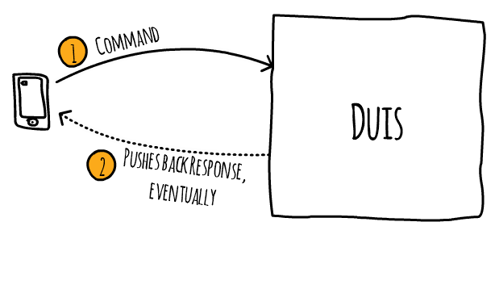
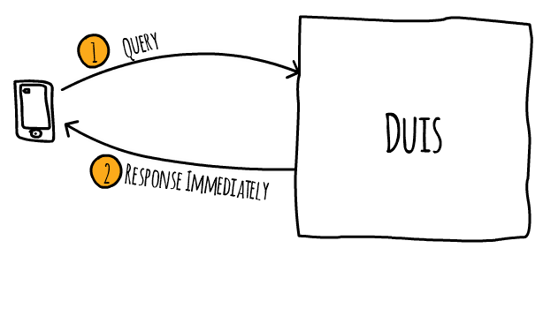

# Duis - online banking for all!
## What is this all about?
Duis is online banking for everyone. The word <b>Duis</b> comes from Latin and means banking and is pronounced "Dooies".

This reference architecture demonstrates software development techniques such as Event Storming, CQRS, Event Sourcing, and Domain-Driven Design (DDD) concepts. It is meant as a guide and example on how a software solution can be developed from the very first idea to its full implementation. It is important to note that the business domain of banking is explored first from a business perspective and then demonstrate how business concepts and knowledge can be captured on the implementation side. The intention is also to capture the human aspects of it such as communicating with the domain experts. Since banking is an overly complex domain, domain-driven design can help capture the complexity of this domain and improve in the quality of the implementation.

The implementation is accomplished using modern tools and services such as the high-performance .net core runtime coupled with the latest AWS serverless technologies. A critical design goal of the solution architecture is to take full advantage of automation and 100% managed services (AWS services). The solution architecture must provide the business with a list of capabilities to stay extremely competitive but extremely low operations cost. It must also be extensible and business capabilities surely will increase over time in part driven by market demands and processes.

## Goals
The new online bank Duis has a simple goal: provide mostly free banking for all and yet be profitable. To achieve this, Duis is built with on-demand cloud-computing in mind. Cloud-computing resources are only used when they are needed to keep the operational cost down as much as possible. In addition, on-going development, and maintenance of Duis is fully automated wherever possible to reduce human errors. All consumer services are free; however, business services do carry small fees. With Duis, security starts before customers even have signed-up. This means secure applications, secure transports, encrypted data in transit and at rest, always. Privacy is preserved even from internal personnel of Duis.

## Business Capabilities
As with any software project and unless you have free money to give away, there must be a business driver to accept the fact that it will cost time and money to create a software solution. In a typical software project, the budget to <b>create</b> this software accounts for only 10% of the total budget until the software is retired. That means 90% will be spent to maintain the solution over time over many years once it is in production. It does not matter how small or large the software solution is. Should we not spent a good amount of time understanding the business domain to increase the chances of success? We should also take care that the software is maintainable. We should also design certain parts of the architecture to be replaceable and not put so much emphasis on reusability. Tale a look at the [sacrificial architecture by Martin Fowler](https://martinfowler.com/bliki/SacrificialArchitecture.html).

Since this is a reference architecture that can certainly be extended with additional features over time, here are the initial sets of business capabilities:

  * Great customer onboarding experience
  * FREE online banking for all consumers
  * Onboarding of customers, accounts, and their relationships
  * Real-time processing of information as it happens
  * Identifying and triggering of red flags and take action as they happen
  * Guaranteeing 100% correct audit logs as the system records every change for accurate traceability
  * Role based authorizations
  * Generate projections and other reports that include past business events
  * Time travel - easily add new reports and projections as they would have existed at any time in the past
  * Debit and Credit Transactions
  * Automatic fraud detection during onboarding and transaction processing

### Great customer onboarding experience
When new customers onboard with Duis, the experience should be an exceptionally smooth one. This means that the user interfaces provided either via mobile apps, web browser, and even native desktop apps must be extremely responsive. Customers should never have to wait for any kind of response back from Duis. The user interface must capture the customers intend via clearly marked actions on the UI. It is those actions that will trigger changes to happen on Duis' backend services. Great care should be taken on the look and feel of every UI element including down to pixel perfect positioning. The design for the look & feel of the UI must match Duis' slogan, colors, and overall marketing. 

### FREE online banking for all consumers
Consumer services are free with the exception of extra services such as credit card offerings. For example, EFT transactions, bill pay, debit card transactions, consumer to consumer wire transactions, electronic wallet transactions, etc. and many more are free.

### Onboarding of customers, accounts, and their relationships
When new customers sign-up with Duis, all required processes from security background checks to account creations are fully automated. Relationships to existing customers and their dependents and friends are identified and tagged for future analysis. The primary goal is for customers to be able to open a new account as quickly as possible and yet be fully compliant with all state and federal regulations.

### Real-time processing of information as it happens
Because Duis is tracking all changes in the system via business events, other services can react to these events as they happen. For example, business events can trigger other actions to happen within Duis or by external systems.

### Identifying and triggering of red flags and take action as they happen
Because Duis has a built-in audit log, it knows when actions need to be prevented to enforce policies and trigger warning notifications.

### Guaranteeing 100% correct audit logs as the system records every change for accurate traceability
Duis records all changes via a set of commands and their resulting domain events. All domain events are recorded in chronological order as they happen. No information gets discarded. 

### Role based authorizations
Actions enter Duis as a set of commands and these commands can only be executed with appropriate authorizations. These commands can come from another system or from a user. Commands get denied execution without the right authorization.

### Generate projections and other reports that include past business events
Duis can generate projections by replaying all domain events and then analyze the domain events. Projections are a powerful way to create reports based on past events and conditions that caused the domain events. Projections can be run continuously or during certain events and continuously feed the business with insights of the situation.

### Time travel - easily add new reports and projections as they would have existed at any time in the past
Since no information is lost in Duis, new report requirements can analyze past events and deliver new insights. Time travel is supported by analyzing domain events since the beginning of time (since the system went into production).

### Debit and Credit Transactions
Customers can execute debit and credit transactions on their respective accounts. Since this is a core functionality of any banking system, it is also very core of Duis and the entire solution. 

### Automatic fraud detection during onboarding and transaction processing
Since Duis is 100% cloud-based, it makes use of automated fraud-detection services whenever possible. 

## Technical Capabilities
The solution architecture is built on CQRS, Event Sourcing, and DDD principles. It also takes advantage of domain events as being the source of truth of the entire system. This means some traditional headaches such as the impedance mismatch does not exist anymore. There are other technical advantages that this design can bring. However, it also comes at a cost of a more complicated architecture from a technical point of view. Here are the technical advantages:

  * 100% Cloud-native Solution
  * Serverless microservice architecture
  * Domain event-based architecture for real-time processing and dashboarding of data
  * CQRS and event sourced architecture for high-performance executions and 100% accurate audit logs
  * Domain-driven design (DDD) to stay as close as possible to the business
  * No impedance mismatch
  * Core domain model to manage all business rules centrally in one place
  * Read models are specifically designed for their purpose using polyglot persistence
  * New read models can be added in the future as if they existed from the beginning. This is achieved by replaying past domain events without side effects. The new read model can process these past domain events one at a time in chronological order. This allows for easy extensions of the architecture and further analysis of existing data.
  * Total read model recovery is possible by replaying and processing all domain events again. This can help in disaster recovery in case a read model is in an inconsistent state or is completely corrupted.

### 100% Cloud-native Solution
DDD does not dictate any technology to use. However, since we are starting this project from scratch, we want to take full advantage of all AWS services available where it makes sense. So, Duis is a 100% cloud-native solution and is designed to take advnatgae of all managed services available to us.

### Serverless microservice architecture
One of our goals is to automate as much as possible. This means that we do not want to worry about scaling our solution or pay for resources when not in use. We want the AWS managed services do all the heavy lifting. Over the years technologies and patterns have evolved so much that it is now primetime to marry them together. It's like a match made in heaven where DDD with its bounded context concept, microservices, event sourced and event-based architectures, serverless compute like Lambda are all fitting very nicely together. We just have to put the Lego pieces together now.

### Domain event-based architecture for real-time processing and dashboarding of data
The source of truth within Duis are the domain events. Domain events are business facts that have happened and can not be changed anymore. As these business events are happening inside Duis, we can listen to these events and act on them such as displaying real-time data coming out of these domain events. Of course, other systems and services could listen to these events as well and act on them.

### CQRS and event sourced architecture for high-performance executions and 100% accurate audit logs
The Command Query Responsibility Segregation (CQRS) pattern splits a system into two parts, the read and write portions of a system. The write part is the one that accepts commands, actions to do something. It then either processes a command or it has the power to deny execution of a command because it failed to comply with business criteria. The read portion is optimized for querying data out of the system. It's not unusal that the read portion uses polyglot persistence and take advantage of the different database and search technologies available. Duis is event sourced and this means it has an event store to save all domain events in chronological order as these domain events are happening. This event store is the source of truth. It is a journal of all domain events. All domain events are immutable. Because the event store is the source of truth, we can always proof on how Duis arives to a state at anytime in the past.

### Domain-driven design (DDD) to stay as close as possible to the business
DDD is really all about getting to know the business domain well. It facilities team learning and gaining this knowledge together as we engage with the domain experts. Ideally, we learn the lingo, the ubiquitous language of a domain. As we speak with all team members, we speak in this lingo. The language will be expressed not just verbally but also in the artifacts we create such as the name of the domain events, the source code artifacts like the class names of the aggregates, value objects, entities, etc. Even this documentation should express this language. Domain experts are not technical experts (for he most part, depending on the domain). Technology is really all about people and not technology, believe it or not. So, the people invloved managing a system, using a system, etc. are important things we need to consider and always keep in mind. 

### No impedance mismatch
Since the microservice(s) only store domain events as immutable, append only events there is no need to use any object-relational mappers such as hibernate etc. An event sourced system like Duis uses an event store as its source of truth. It does not store a current state but streams of business events in chronological order as they happen. We do not have to worry about complicated object graphs to persist into a two-dimensinal SQL database.  

### Core domain model to manage all business rules centrally in one place
Since we are using DDD, we know excatly where we need to go to to add or update business rules: the domain model. Business rules won't be sprinkled to many parts of the system, or heaven forbid, the database. Duis will not be using a rules engine of any kind since the rules are part of aggregates responsbilities and make sure they are always 100% correct (that is why they exist in DDD in the first place). Having a domain model contain all business rules also makes it great for automated tests.

### Read models are specifically designed for their purpose using polyglot persistencee
Since we are using the CQRS pattern, we need at least one read model for the query side of things. However, it is very common to have several read models to express the need to get helpful information out of a system. To do this, Duis has two read models to start with, read model 1 for the UI screens, and read model 2 for simple projections to create reports. We could add more read models over time. For example, we could add a read model for full text searching capabilities, another one for for file extractions, etc. Each read model has it's own API endpoints. Each read model is its own microservice and can be maintained completely seperate from the rest of Duis.

## Making Changes via Commands

  

## Asking for Information via Queries

  

